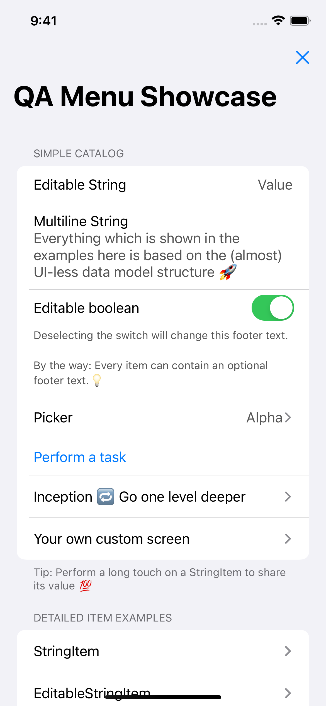

# QAMenu

[](http://cocoadocs.org/docsets/QAMenu)
[](http://cocoadocs.org/docsets/QAMenu)
[](http://cocoadocs.org/docsets/QAMenu)
[](https://swift.org)

[](https://codecov.io/gh/tschob/QAMenu)

Did you ever want to quickly:

* Access internal debug information when testing your app?
* Provide internal shortcuts in your app to e.g. reset usually not accessible states?
* Expose the available feature toggles and override them?
* Test if your crash reporter still works?
* ...

Good, in that case you can stop worrying about the needed coding effort, UI code, view models and so forth. 

QAMenu is here to help you. It's a reduced data model driven layout renderer tailored to the usage of QAMenus, debug menus and settings screens which are not shipped to end users, but only used internally. Unlike the system settings bundle, it directly lives in your app and is interactive. You can directly retrieve information and execute actions.

You can think about it as your design system for debug menus.

QAMenu comes with a small catalog which contains some very generic models, for example to display the app version, expose the Info.plist content or executing a crash. Though its main focus is to provide you a framework to add your custom debug information / action when you need it in your daily life - with minimal effort and without touching UI code (if not really necessary).

Enough intro. This showcase gives you a sneak preview. What you see is a QAMenu instance. Everything which is shown in the examples is based on the (almost) UI-less data model structure.

<div align="center">
   
</div>

You can try for yourself by running the example app in `Examples/Example-iOS` and selecting the showcase menu.


## Vision

QAMenu is based on the following vision:

> **Debug features in your app should be integral part of your teams workflow. Instead of relying on temporary hacks which hijack existing UI elements locally, they should be made accessible to the complete team, permanently accessible and developers should always be able to quickly add more without the fear that there is not enough time to do so.**

Derived from this vision it follows below principles.

* [Be data (model) driven aka *stop worrying about UI*](Docs/Principles.md#1-be-data-model-driven-aka-stop-worrying-about-ui)
* [Provide the infrastructure, not the content](Docs/Principles.md#2-provide-the-infrastructure-not-the-content)
* [Items should be interactive](Docs/Principles.md#3-items-should-be-interactive)
* [Allow extensive customisation, but optimize for default usage](Docs/Principles.md#4-allow-extensive-customization-but-optimize-for-default-usage)
  * [Use composition whenever possible](Docs/Principles.md#41-use-composition-whenever-possible)
* [Keep it focused on one purpose](Docs/Principles.md#5-keep-it-focused-on-one-purpose)

See [Principles](Docs/Principles.md) for a detailed description of each principle.

## Usage

QAMenu is presented as standalone window. It can be either be opened by calling the method `show()` or by shaking the device.

The configuration can be done during the app start. To be able to create a QA menu, you need to pass the menu structure as well. Instead of working with delegates, most data model types are boxed as `Dynamic<T>` which is able to hold either the plain value, a closure or key path. QAMenu and its UI renderer unbox the content only once it's needed. This enables real time behaviour.

Typically QAMenu could be stored and initialised in the App Delegate:

```swift

@UIApplicationMain
class AppDelegate: UIResponder, UIApplicationDelegate {

  // You need to keep a reference to QAMenu, otherwise it will be released from memory
  var qaMenu: QAMenu?

  ...
  
  private func setupQAMenu() {
   let groups: [Group] = [
      QAMenu.Catalog.AppInfo.group(),
      self.cacheGroup,
      QAMenu.Catalog.Preferences.group()
    ]
    self.qaMenu = QAMenu(
      pane: RootPane(title: .static("Simple Project"), groups: groups),
      presenterType: QAMenuUIKitPresenter.self
    )
    self.qaMenu?.setTrigger([.shake], mode: .initialValue)
  }
  
  private var cacheGroup: [Group] {
    let group = ItemGroup(title: .static("App Cache"), items: .static([
      BoolItem(
        title: .static("Enable cache"),
        value: .computed({ [weak self] in
            return self?.simpleProjectCacheEnabled ?? false
        }),
        onValueChange: { [weak self] value, _, result in
            guard let self = self else {
              result(.failure("Object was released from memory"))
              return
            }
            self.simpleProjectCacheEnabled = value
            result(.success)
        }
      ),
      StringItem(
        title: .static("Cached images"),
        value: .computed({ [weak self] in
          return String(describing: self?.cache.imagesCount ?? 0)
        })
      ),
      ButtonItem(
        title: .static("Reset image cache"),
        action: { [weak self] (item: ButtonItem, _) in
          item.status = .progress("Deleting cache")
          DispatchQueue.main.asyncAfter(deadline: .now() + 1) {
            self?.simpleProjectCachedImagesCount = 0
            item.status = .idle
            item.parentGroup?.invalidate()
          }
        }
      )
    ]))
    return group
  }
}
```

This screenshot shows the resulting QAMenu. You can also find and use the code in the example app which is located in `Examples/Example-iOS`.

<div align="center">

</div>

## Roadmap

*Legend*
	
✅ = *Supported*  
🚧 = *In development*  
🤔 = *Might be added in future*   
❌ = *Not supported*


**Renderer**

| Syntax | iPhone | iPad | Watch | Mac | TV |
| --- | --- | --- | --- | --- | --- |
| QAMenuUIKit | ✅ | ✅* | ❌ | ❌ | ❌ |
| QAMenuSwiftUI | 🚧 | 🚧 | 🚧 | ❌ | ❌ |

**iPad is supported, but no UI optimizations like split view done*

**Supported Data types - Layout**

- ✅ Panes (aka screens / view controllers)
- ✅ Nested panes (aka child panes)
- ✅ Groups
- ✅ Picker groups

**Supported Data types - Items**

- ✅ Strings (editable)
- ✅ Buttons
- ✅ Booleans (editable)
- ✅ Footers
- ✅ PickableStrings
- ✅ ProgressItem
- 🤔 StepperItem
- 🤔 SliderItem

**Capabilities**
 
- ✅ Tap items long to share them
- ✅ Search in panes
- ✅ Invalidation (reloading) of items, groups and panes
- ✅ Add / remove items dynamically in groups
- ✅ Edit strings (single line)
- 🤔 Edit strings (multiline)
- ✅ Async loading operation (Items)
- 🤔 Async loading operation (Groups)
- ✅ Interface to trigger dialogs on Items and Groups

See [DataStructure](Docs/DataStructure.md) for more details.

**Tests**

- ✅ Unit tests
- 🤔 UI tests
- 🤔 UI Snapshot tests

**CI**

- ✅ Run unit tests in PRs
- ✅ Compile example apps in PRs
- ✅ Lint in PRs
- 🤔 Run UI tests in PRs

**Documentation**

- ✅ README
- 🤔 Documentation in the source code
- 🤔 Wiki with more detailed integration and public API description

## QAMenu catalog

QAMenu provides the separate framework `QAMenuCatalog` which contains some very basic debug items. It acts as usage example and reusable configuration for these very basic items.

Some example screenshots:

<div align="center">


</div>

See [Catalog](Docs/Catalog.md) and the example app for more details.

## Installation

### CocoaPods

[CocoaPods](http://cocoapods.org) is a dependency manager for Cocoa projects. You can install it with the following command:

```bash
$ gem install cocoapods
```

To integrate QAMenu into your Xcode project using CocoaPods, specify it in your `Podfile`:

```ruby
source 'https://github.com/CocoaPods/Specs.git'
platform :ios, '10.0'
use_frameworks!

target '<Your Target Name>' do
    pod 'QAMenuUIKit'
end
```

Then, run the following command:

```bash
$ pod install
```

### Manual integration

To integrate QAMenu directly from the source code, follow the usual integration steps. You can use `Examples/Example-iOS` as real life example.
